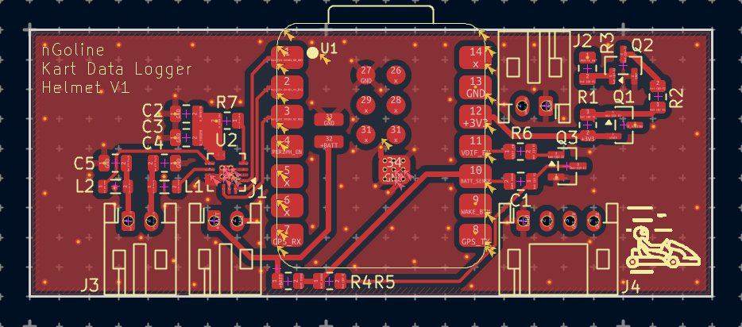
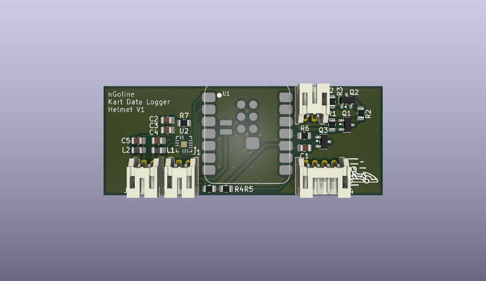
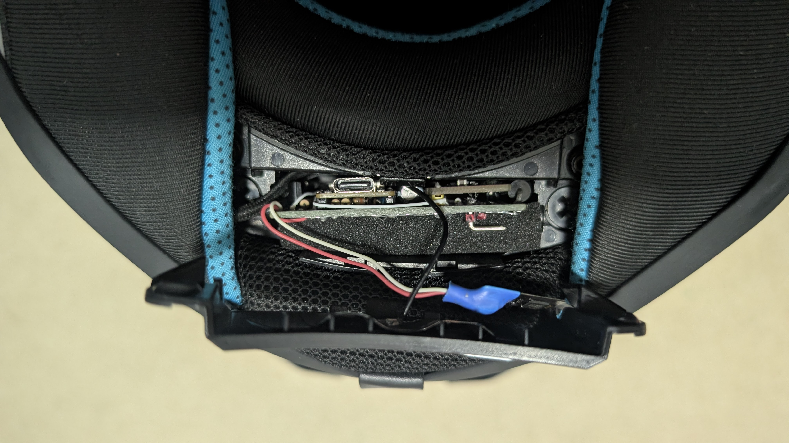
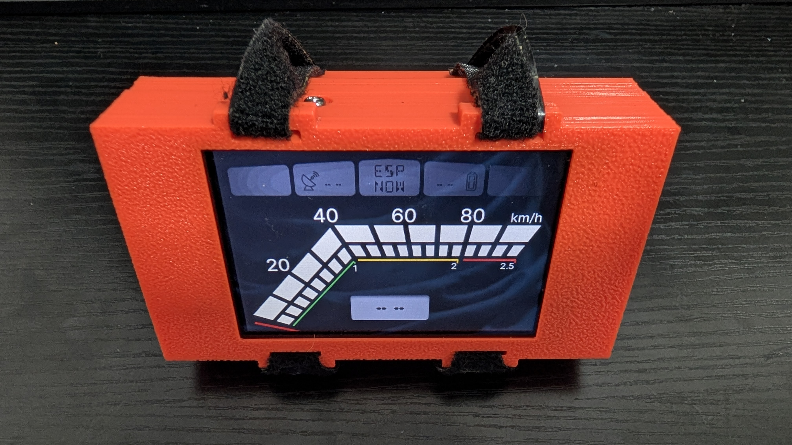

# ESP32 Kart Telemetry System

A distributed telemetry and datalogging system for open-track go-karts. The project uses a helmet-mounted logger node paired with an ESP32 display dashboard over ESP-NOW.

## System Architecture

The current firmware supports two primary targets:

1. **Helmet Logger Node**
   * **Board:** Seeed XIAO ESP32S3
   * **Role:** GPS acquisition, battery monitoring, audio cues, error logging, and telemetry broadcast.
   * **Features:**
     * GPS from u-blox (default) or ATGM336.
     * Battery percentage sampling.
     * Audio playback through I2S.
     * Helmet error log capture and transfer.
     * Telemetry packet composition using GPS, IMU feedback, and battery state.

2. **Display Dashboard Node**
   * **Board:** ESP32-3248S035C
   * **Role:** UI dashboard, SD logging, and optional IMU-based speed filtering.
   * **Features:**
     * Receives telemetry from the helmet logger over ESP-NOW.
     * Displays speed, G-force, GPS satellite count, and helmet battery state.
     * Logs telemetry to SD card.
     * Sends IMU feedback to the helmet logger when `ENABLE_IMU` is enabled.
     * Receives helmet error logs and writes them to SD.

### Build targets in `platformio.ini`

* `env:logger` — helmet logger firmware (`main_logger.cpp`)
* `env:display` — display dashboard firmware (`main_display.cpp`)

## Key Technical Features

* **ESP-NOW telemetry link** between the helmet logger and display dashboard.
* **Modular GPS provider** abstraction in `GpsManager`.
* **`fix_stride.py` prebuild patch** for SquareLine Studio LVGL 9 image exports.
* **Helmet error log transport** from logger to display via structured ESP-NOW messages.
* **Optional wheel IMU support** on the display dashboard to improve speed filtering and live telemetry.
* **SPI bus arbitration** for display rendering and SD card access using a mutex.

## Hardware Requirements

* ESP32-3248S035C display board
* Seeed Studio XIAO ESP32S3 logger board
* GPS module (u-blox or ATGM336)
* Optional MPU6050 IMU for wheel/dashboard module
* I2S audio amplifier and speaker
* SD card formatted FAT32 for dashboard logging

## Software Dependencies

Built with PlatformIO.

Libraries used by the current configuration:

* `lvgl/lvgl` (v9.x)
* `rzeldent/esp32_smartdisplay`
* `mikalhart/TinyGPSPlus`
* `ElectronicCats/MPU6050`
* `espressif/esp32-audioI2S`

## GPS Providers

The logger firmware supports two GPS providers through `GpsManager`.

* **u-blox provider** (default)
  * No additional build flag required.
  * Update interval: `200ms` (5Hz).
* **ATGM336 provider**
  * Enable with `-D GPS_PROVIDER_ATGM336`.
  * Update interval: `100ms` (10Hz).

### Changing the GPS provider

In `platformio.ini`, under `[env:logger] -> build_flags`:

* Comment out `-D USE_FAKE_GPS` to use real GPS hardware.
* Uncomment `-D GPS_PROVIDER_ATGM336` to select the ATGM336 provider.
* Leave `-D GPS_PROVIDER_ATGM336` commented to use u-blox.

Telemetry timing is derived from `GpsManager::getUpdateIntervalMs()`, so the logger loop cadence automatically follows the selected GPS provider.

## Setup & Installation

1. Clone this repository.
2. Open it in VSCode with PlatformIO.
3. Edit the UI using the SquareLine Studio project files in `UIDesign/`.
4. Export the UI to `/lib/ui/` and let `fix_stride.py` patch LVGL image metadata during build.
5. Flash the selected firmware:
   * `pio run -e logger -t upload`
   * `pio run -e display -t upload`

## ESP-NOW Protocol

The telemetry protocol is defined in `lib/Shared/EspNowProtocol.h`.

* `MSG_TELEMETRY` — helmet logger broadcast.
* `MSG_IMU_FEEDBACK` — dashboard IMU uplink to logger.
* `MSG_ERROR_LOG_START`, `MSG_ERROR_LOG_LINE`, `MSG_ERROR_LOG_END` — helmet error log transfer.

The current codebase uses `ESPNOW_CHANNEL 1` for all packet exchanges.

## Design files

Design files are included under the `hardware/` folder.

### 3D Models

I've used Fusion to design 3D models for the custom enclosures and mounts. These are located in `hardware/3d_models/` and exported as `.f3d` and `.3mf` files. You can open and modify these in Fusion or any compatible 3D modeling software.

### PCB Designs

The PCB design is created in KiCad and located in the `hardware/pcb/` folder. The helmet logger PCB is designed to fit within the existing enclosure on the MT Stinger 2 helmet (this enclosure was built to fit Universal Communication Systems hardware and can be found on other helmets).

## Visual Reference

The repository includes renderings and module photos in the `images/` folder.

## Notes

* The display firmware is responsible for UI rendering and SD logging.
* The logger firmware is responsible for GPS, battery, audio, and helmet error captures.
* `USE_FAKE_GPS` is available for development without real GPS hardware.
