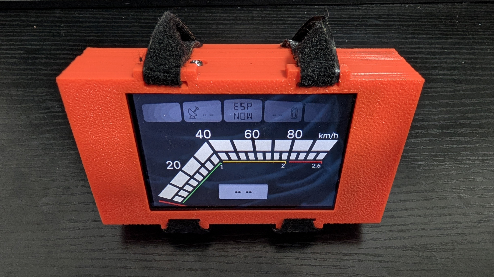

# ESP32 Kart Telemetry System

A telemetry and datalogging system for open-track go-karts, built around a single
steering-wheel-mounted ESP32 display board that handles everything: GPS
acquisition, lap timing, dashboard rendering and SD logging.

> **Note:** earlier revisions of this project split the work between a
> helmet-mounted logger node and the display, linked over ESP-NOW. That helmet
> node proved unreliable at the track and has been removed — the display is now
> the only node.

## System Architecture

Single target: the **Display Dashboard Node**.

* **Board:** JC3248W535N (ESP32-S3, AXS15231B QSPI panel)
* **Role:** GPS acquisition, lap detection, UI dashboard, and SD logging.
* **Features:**
  * GPS from ATGM336 (default) or u-blox, wired directly to the board.
  * Live speed, G-force, satellite count and display battery state.
  * Finish-line based lap detection with best/previous lap deltas.
  * Telemetry logged to SD card per recording session.
  * Optional MPU6050 IMU for speed filtering and steering angle.

### Build targets in `platformio.ini`

Both targets build the same application (`src/main_display.cpp`) and differ only
in the panel driver backend:

* `env:display_gfx` — Arduino_GFX backend (`lib/DisplayGFX`). **Default.**
* `env:display` — esp_lcd backend (`lib/DisplayBSP`). Fallback.

The Arduino_GFX backend is the default because it resolves a QSPI panel wedge
seen with the esp_lcd path.

## Key Technical Features

* **Modular GPS provider** abstraction in `GpsManager`.
* **Finish-line lap detection** in `LapManager`, driven by GPS position.
* **`fix_stride.py` prebuild patch** for SquareLine Studio LVGL 9 image exports.
* **Display-wedge watchdog** — a 5s task watchdog on `loopTask` turns a panel
  wedge into a fast auto-reset instead of a permanent freeze.
* **Charge mode** to keep the board from eating the charger's current budget.
* **Optional IMU support** to improve speed filtering and live telemetry.

## Charge mode

The charger's current is shared between the board and the cell, so a running
dashboard slows charging considerably. Charge mode parks the device:

* Stops the recording session and closes the GPS UART.
* Drops the CPU to 80 MHz (the floor for stable USB-CDC — don't go lower).
* Swaps to a minimal charge screen and blanks the backlight after 15s.

It is **only ever entered manually**, from the `CHARGE MODE` button on the
config screen. Nothing enters it automatically, so bench testing and debugging
are unaffected.

While parked: tap anywhere to wake the backlight and read the battery for
another 15s; press `RESUME` to leave. Resuming re-probes the GPS, which takes a
couple of seconds.

> **The GPS module keeps running.** `gps.end()` only closes the ESP32's UART —
> the ATGM336 has no power gating on this board, so it continues drawing
> ~25-40 mA. Cutting it needs a `$PCAS12` standby command or a load switch on
> its VCC, neither of which is wired yet.

> **The percentage reads high while charging.** With no power-path charger the
> sense divider sits on the charger rail, so it measures the cell terminal
> voltage *under charge*, which is well above its resting value — expect a
> jump downward when you unplug. It's shown as `~94%` to mark it approximate;
> the voltage below it is the number to trust.

The charge screen and the config-screen button are both built at runtime in
`lib/UiHelper/uiHelper.cpp` rather than exported from SquareLine, so
re-exporting `lib/ui/` will not wipe them.

## Hardware Requirements

* JC3248W535N display board
* GPS module (ATGM336 or u-blox) wired to `RX=6` / `TX=7`
* Optional MPU6050 IMU
* microSD card formatted FAT32

## Software Dependencies

Built with PlatformIO.

* `lvgl/lvgl` (v9.x)
* `moononournation/GFX Library for Arduino` (`display_gfx` only)
* `mikalhart/TinyGPSPlus`
* `ElectronicCats/MPU6050`

## GPS Providers

`GpsManager` supports two providers.

* **ATGM336 provider** (current default)
  * Enabled with `-D GPS_PROVIDER_ATGM336`.
  * Update interval: `100ms` (10Hz).
* **u-blox provider**
  * Leave `-D GPS_PROVIDER_ATGM336` out of the build flags.
  * Update interval: `200ms` (5Hz).

The flag lives in `[display_common] -> build_flags_base`, so it applies to both
build targets at once.

### GPS wiring

The GPS UART pins are set by `GPS_STANDALONE_RX` / `GPS_STANDALONE_TX` in
`[display_common]`, currently `6` and `7`.

Watch for collisions when changing these: `GPIO5` carries the battery sense
divider (`DISPLAY_BATT_ADC` in `src/main_display.cpp`), and `GPIO18`/`GPIO17`
are the IMU's I2C pins when `ENABLE_IMU` is set.

## Filesystem & Storage

The display reads and writes to a **FAT32 microSD** card. No files need to be
pre-populated — the display creates what it needs on first boot — but the files
below may be edited on a computer for configuration.

#### `/config.ini` (auto-created)

Stores display preferences. Created with defaults on first boot if absent.

```ini
# Kart Data Logger Configuration
theme=dark          # dark | light
selected_track=0    # index into tracks.ini
```

#### `/tracks.ini` (optional, user-created)

Defines named tracks with GPS finish-line coordinates. The display reads this at
boot and populates the track selector in the UI. If absent, no tracks are
preloaded.

```ini
# Kart track configurations
count=2

0_name=Kartódromo Granja Viana
0_left_lat=-23.60488969
0_left_lon=-46.83622658
0_right_lat=-23.60493793
0_right_lon=-46.83641597

1_name=My Track
1_left_lat=0.00000000
1_left_lon=0.00000000
1_right_lat=0.00000000
1_right_lon=0.00000000
```

#### `/log_N.csv` (auto-created per session)

Telemetry session logs. A new numbered file is created each time a recording
session starts.

```
epoch,speed,totalGForce,gForceX,gForceY,steering_angle,sats,lat,lng
```

## Setup & Installation

1. Clone this repository.
2. Open it in VSCode with PlatformIO.
3. Edit the UI using the SquareLine Studio project files in `UIDesign/`.
4. Export the UI to `/lib/ui/` and let `fix_stride.py` patch LVGL image metadata during build.
5. Flash the firmware: `pio run -e display_gfx -t upload`
6. Insert a FAT32 microSD card into the display. A default `config.ini` is created on first boot.

## Dormant libraries

These libraries are no longer part of the build — nothing includes them — but
they are kept in `lib/` because they may be useful again:

* `EspNowManager` + `Shared/EspNowProtocol.h` message types — the board-to-board radio link.
* `ErrorLogManager` — LittleFS error capture and transfer.
* `AudioManager`, `VoiceParser` — I2S playback and spoken number/lap announcements.
* `PowerManager` — button-driven hibernate and power gating.
* `FakeGps` — CSV replay for development without GPS hardware.

`Shared/EspNowProtocol.h` is still compiled: `TelemetryMsg` is the record the
display passes between the UI, the lap manager and the SD log task.

## Design files

Design files are included under the `hardware/` folder.

### 3D Models

I've used Fusion to design 3D models for the custom enclosures and mounts. These
are located in `hardware/3d-models/` and exported as `.f3d` and `.3mf` files.
You can open and modify these in Fusion or any compatible 3D modeling software.

## Visual Reference

The repository includes module photos in the `images/` folder.



## Notes

* The display firmware owns the whole pipeline: GPS, lap timing, UI and SD logging.
* Lap detection only runs while a recording session is active.
